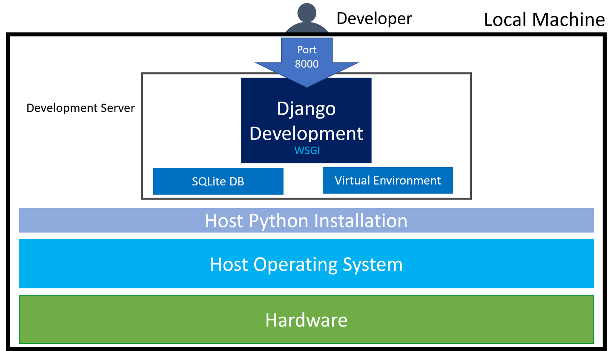

# Audio Server Docker
This repository is version 3 of the mental wellness server application. Its primary objective is to serve relaxing audio files that help improve mental states. This is a Django application that can be dockerized and deployed in production with nginx, gunicorn, and postgres. There are also intructions to run Django's development server for front end work, and the docker build can be run in local development mode.

## Table of Contents
1. [Repo Overview](#overview)
    1. [High Level](#highLevel)
    2. [audio_app](#audio_app)
    3. [audio_server](#audio_server)
    4. [nginx](#nginx)
    5. [Testing](#testing)
2. [Getting Started](#getting_started)
    1. [Local Front End Development](#front_end)
    2. [Docker Dev Build](#docker_dev)
    2. [Docker Prod Build](#docker_prod)
3. [Server Infrastructure Overview](#infrastructure)
    1. [Docker Production Server](#docker_prod)
    2. [Reference Virtual Machine Deployment](#reference_vm)
    3. [Development Server](#dev_server)
4. [Contribution Guidlines](#guidelines)
5. [Site Management](#management)
6. [Contributors](#contributors)


## Repo Overview <a name="overview"></a>
### High Level  <a name="highLevel"></a>
```
wellness_server_v3
│   .env.dev                    # Environment Variables for local development
│   .env.prod                   # Environment Variables for production
│   .gitignore                  # General Django gitignore
│   docker-compose.dev.yml      # Container architecture for local development
│   docker-compose.yml          # Container architecture for production
│   Dockerfile                  # Container structure for Django component of the application
│   entrypoint.sh               # Startup instructions for Docker build
│   init-letsencrypt.sh         # Initialize production certificates
│   manage.py                   # Manage the Django application (database, superusers, collectstatic, runserver, ...)
│   README.md                   # You are here.
│   requirements.txt            # Application Dependencies
│
└───audio_app              # Core of the application with the views, models, and templates for the front end of the web application.
│
└───audio_server           # Standard django configuration folder for the project
│
└───nginx                  # Configuration settings for the production nginx build
│
└───testing                # All test cases for project
```

### audio_app <a name="audio_app"></a>
```
audio_app
│   init.py                     # Marks directory as python package
│   admin.py                    # Connects app models to Django admin interface
│   apps.py                     # Adds app to application
│   forms.py                    # Connect users to models
│   models.py                   # Connect models to database
│   utils.py                    # Various Helper Functions
│   views.py                    # Request handling logic
│
└───templates
│   │   addToPlaylist.html      # Form to add a file to user created playlist
│   │   chatbot.html            # Temp chatbot in progress page
│   │   createPlaylist.html     # Form to create a playlist
│   │   listen_files.html       # Table populated with files from a user playlis or a cateogry
│   │   listen_landing.html     # List out the 9 file categories with descriptions and links to category list
│   │   upload.html             # Form to add files
│   │
│   └───home                    # Static home pages
│       │   about.html
│       │   background.html
│       │   disclaimer.html
│       │   homeLinks.html
│       │   index.html
│       │   instructions.html
│       │   sponsors.html
│
└───migrations                  # Sync database structure with model changes
│   __init.py__
│   0001_initial.py
│   ... 

```

### audio_server <a name="audio_server"></a>
```
audio_app
│   init.py                     # Marks directory as python package
│   asgi.py                     # Configures Asynchronous server (not yet used)
│   forms.py                    # Registration entries
│   settings.py                 # Configurations settings for site
│   urls.py                     # Map URLs to view functions
│   views.py                    # Registration Views
│   wsgi.py                     # Configures Web Server Gateway Interface
│
└───templates
│   │   base.html               # Skelaton for other html files, to be extended from
│   │
│   └───registration            # For user authentication
│       │   login.html
│       │   logout.html
│       │   register.html
│
└───static
    |
    └───css                     #  Add to template with `src=""`, will probably not need more css files
    |   |   main.css
    |   
    └───img                     #  Add to template with `src=""`
    |   |   background-tree.jpg
    |   |   ...
    |
    └───js                      #  Add to template with `src=""`
        |   styleActiveTab.js   #  Add CSS class "active" with id = value of "activeTab" in template variables
        |   audioPlayer.js      #  Makes the audio player work
        |   topnav.js           #  Hides the title in topnav (leaving logo) for narrow screens

```
Note that in this structure, we have authentication views and forms in th django configuration folder, and leave the other views to the audio_app. In general this folder should not be expanded on further beyond these general items, and further functionality should be in the audio_app or a new app. 

### nginx <a name="nginx"></a>
```
nginx
│   Dockerfile                  # Production Dockerfile
│   Dockerfile.dev              # Local Dev Dockerfile
│   nginx.conf                  # Production Configuration
│   nginx.dev.conf              # Local Dev Configuration
```

### Testing <a name="testing"></a>
```
testing
│   init.py                     # Marks directory as python package
│   apps.py                     # Adds app to application
|   test_*.py                   # Automatically called by python manage.py test
|   ...
|   gimme_disco.mp3             # Sample audio file for testing
```


# Getting Started <a name="getting_started"></a>
This application can run in 3 modes: (1) local front end devlopment (2) dev docker (3) prod docker. (1) runs a lightweight development server which is a django built-in. It creates a sqlite datatbase and serves static/media files all on port 8000. It's useful for developing views and styling where you are constantly changing files and want to view the change in your browser since it initializes quickly. It runs very differently than the production server, so it should only be used for front end development usage. Consider this mode's functionality similar to just opening raw html files in your browser, where the local server will pull in static files and allow you to render templates with a dummy database. (2) runs a full production grade dockerized build of the project with a reverse proxy and postgres database over http that can run locally. (3) Runs the build on https, generating and automatically renewing certificates. It will not run on your local machine since it requires thoughtline.org to point at the machine's IP, which is only true on our production machine. 


## (1) Local Front End Development <a name="front_end"></a>

### Step 1, Clone Repo, Prepare To Setup
- Check you have [python](https://www.python.org/downloads/) and [pip](https://packaging.python.org/en/latest/tutorials/installing-packages/) installed on your system. Using VSCode is recommended. 
```console
git clone https://bitbucket.org/fletcher2014/wellness_server_v3/src/master/
```

### Step 2, Create and activate virtual environment 
- Navigate to the folder you just cloned
- Create the Virtual Environment (only do once)
    - Windows: *note: depending on your setup you may need to replace "python" with "py"* 
        ```console
        pip install virtualenv
        ```
        ```console
        python -m venv wellness_venv
        ```
    - Mac:
        ```console
        pip3 install virtualenv
        ```
        ```console
        python3 -m venv wellness_venv
        ```
- Activate the Virtual Environment
    - Windows:
        ```console
        wellness_venv\scripts\activate
        ```
    - Mac:
        ```console
        source wellness_venv/bin/activate
        ```
        

### Step 3, Install Python dependencies 
- Windows:
    ```console
    pip install -r requirements.txt
    ```
- Mac:
    ```console
    pip3 install -r requirements.txt
    ``` 

### Step 4, Create local development SQLite database, run migrations
- Windows:
    ```console
    python manage.py migrate
    ```
- Mac:
    ```console
    python3 manage.py migrate
    ```

### Step 5, Run Django dev server
- Windows: 
    ```console
    python manage.py runserver
    ```
- Mac: 
    ```console
    python3 manage.py runserver
    ```
### Step 6, additional notes
- The wellness server should be running locally at http://127.0.0.1:8000
- You will probably want to create a superuser and admin account. See the site management section for details. While the deployment mode is different than production, management of the site once its running is the same.
- The server automatically restarts when you change files, this does not happen with the docker build. Also note that your browser may cache static files, and you will need to either disable this or clear your browser cache when changing static files.
- A new folder called mediafiles will automatically be created in this mode in addition to the sqlite database. It will be ignored by git.


## (2) Dev Docker <a name="docker_dev"></a>

### Step 1, Clone Repo, Prepare To Setup
- Check you have [python](https://www.python.org/downloads/) and [pip](https://packaging.python.org/en/latest/tutorials/installing-packages/) installed on your system. Using VSCode is recommended. 
```console
git clone https://bitbucket.org/fletcher2014/wellness_server_v3/src/master/
```

### Step 2, Run the Docker Daemon
This is done most easily by [downloading docker desktop](https://www.docker.com/products/docker-desktop/). Opening the desktop application which automatically starts the daemon. There are [alternatives](https://docs.docker.com/get-docker/) 

### Step 3, fix .sh permissions
- Windows (in admin terminal, preferable to use [Windows Subsystem for Linux](https://learn.microsoft.com/en-us/windows/wsl/install)):
    ```console
    icacls entrypoint.sh /reset
    ```
- Mac:
    ```console
    chmod +x entrypoint.sh
    ```

### Step 4, run application with logs
```console
docker-compose -f docker-compose.dev.yml build
```
```console
docker-compose -f docker-compose.dev.yml up
```

The server is now running at http://127.0.0.1. Note server logs are being printed which is useful for debugging. Print statements from the view functions are printed here in addition to the request logs. Also note the server is running on http://127.0.0.1 and not http://127.0.0.1:8000 like the front end development server. While the wsgi server is running on port 8000, it is not exposed to the web, rather only internally to other docker services. Now, nginx is listending on port 80, the default http port, which is the new gateway to the application.

### Step 5, executing server maintenence commands
To execute manual server commands, we need to run the application without printing server logs. Do this with
```console
docker-compose -f docker-compose.dev.yml up -d --build
```
The build will not automatically run database migrations. Do this with:
```console
docker-compose -f docker-compose.dev.yml exec web python manage.py migrate --noinput
```
In general, we can user "docker-compose -f docker-compose.dev.yml exec web python manage.py {command}" to run commands in the containers, where "web" is the name of the wsgi server we specified in docker-compose.yml,
and we specify we are using the dev version docker-compose file

### Troubleshooting
When setting up the docker server for the first time, there are some common issues that can happen; this readme will be updated with solutions to these problems as we encounter them

1. If (`docker-compose`) is out of date, you can update it easily using `pip`.
2. The newer method of using `compose` is through docker itself, but this requires the installation of a new plugin, unless you have Docker Desktop, which ships with the `docker compose` command ready to go. Instead of using `pip`, this plug-in adds `docker compose` as a valid command. To install it, use `sudo apt-get- install docker-compose-plugin` on Ubuntu, and the equivalent command on other Linux distros. For MacOS, this plug-in can be installed with [homebrew](https://brew.sh/), with the command `brew install docker-compose`. Note that there might be another step required for MacOS, as detailed [here](https://github.com/docker/compose/issues/8630#issuecomment-1169537632) There is no `docker-compose-plugin` on Windows.See [here](https://github.com/docker/compose/issues/8630#issuecomment-1141930536) for the github issue relating to this.
3. Another issue that is easy to run into is nginx (or possibly another component) saying the port is blocked. While you can run `docker-compose up -p PORT_NUMBER` to run on a different port, it is advisable to figure out what is blocking the original port, since that may cause problems in the future. If you are running Ubuntu, the most [common](https://stackoverflow.com/questions/14972792/nginx-nginx-emerg-bind-to-80-failed-98-address-already-in-use) problem is Apache listening on that port by default. If you are not using or don't need apache to be running on that port, you can kill the process with `sudo /etc/init.d/apache2 stop` on Ubuntu and `sudo apachectl stop` on other Linux Distros. Please be careful with sudo commands, and always run them at your own peril (the command itself is innocuous, but it is always important to keep that advice in mind). If that does not work, you may need to look up "how to see what is binding port 80 on Windows/Mac/Linux", find the process, and kill it (if it is not important). Sadly, the number of methods to this are too many to enumerate, but it should be a straightforward process.


## (3) Prod Docker <a name="docker_prod"></a>

### Step 1, install docker (if new machine)
[install docker on a linux machine](https://docs.docker.com/engine/install/ubuntu/)

### Step 2, clone repo (if new machine)
To clone the git repo, you can [generate an ssh key and configure it in your bitbucket account](https://www.theserverside.com/blog/Coffee-Talk-Java-News-Stories-and-Opinions/BitBucket-SSH-Key-Example). 

### Step 3, setup certificates (if new machine)
There is an additional step to generate the first ssl certificates, which can be done by running  ./init-letsencrypt.sh. There is a very annoying problem with https and nginx that nginx cannot boot without ssl certificates, and cannot generate certificates without booting. We found [this script](https://github.com/wmnnd/nginx-certbot) and configured for our domain under the file init-letsencrpyt.sh. This will run an initial boot and you can then build the code with certificates automatically renewed every 12 hours by the Certbot container.

### Step 4, run application, server maintenence commands
The production docker-compose file is just docker-compose.yml, not docker-compose.dev.yml. This version will not build on your local machine due to the ssl certificate script. Nonetheless, commands are the same for this version as the dev version, simply removing the "-f docker-compose.prod.yml" substring from the commands. 

Build and spin up in silent mode
```console
docker-compose up -d --build
```
The build will not automatically run database migrations. Do this with:
```console
docker-compose exec web python manage.py migrate --noinput
```
In general, run django manage commands with 
```console
docker-compose exec web python manage.py {{command}}
```


# Server Infrastructure Overview <a name="infrastructure"></a>
## Dockerized Production Server <a name="docker_prod"></a>
The production server consists of an Nginx reverse proxy, and Gunicorn WSGI server, and a Postgre SQL database. These components run as docker containers and connect to eachother via internal networking. Port 80/443 is exposed externally for http/https requests where nginx is listening. Static and media requests are served directly, and other requests are passed to the guinicorn wsgi server listening on port 8000. The database is available to all services on port 5432. Certbot is also running in the background, not pictured in this diagram.


## Reference VM Server <a name="reference_vm"></a>
For reference, below is a comparable deployment structure in a more traditional virtual machine deployment. 


## Development Server <a name="dev_Server"></a>
The development server only runs a lightweight wsgi server. This runs our view functions in a virtual environment in addition to serving static and media and connecting to a sqlite database. 




# Contribution Guidelines <a name="guidelines"></a>
## Branches
- Please work on a branch and get pull requests reviewed by a peer before merging. 
## Test Cases
- With the structure of the testing folder, all tests are run with the command `python manage.py test`
- Run unit tests in the Development Server virtual environment. 
    - Windows:
        ```console
        wellness_venv\scripts\activate
        ```
        ```console
        python manage.py test
        ```
    - Mac:
        ```console
        source wellness_venv/bin/activate
        ```
        ```console
        python3 manage.py test
        ```
- Test cases can also run within the docker build. Spin up containers in silent mode, then run
    - Local Dev
        ```console
        docker-compose -f docker-compose.dev.yml exec web python manage.py test
        ```
    - Prod
        ```console
        docker-compose exec web python manage.py test
        ```
- Please maintain the testing standard and add in new test cases for new functionality before merging with master


# Site Management <a name='management'></a>
Once the site is running in your respective mode, management is fairly easy. As discussed in previous sections, commands to a running server are executed with
- Local Front End Dev
    ```console
    python(3) manage.py {{command}}
    ```
- Local Dev
    ```console
    docker-compose -f docker-compose.dev.yml exec web python manage.py {{command}}
    ```
- Prod
    ```console
    docker-compose exec web python manage.py {{command}}
    ```

## User Management (ALL MODES)
- We have 3 user tiers on the site, superuser, admin, regular. Superusers are responsible for managing who admin users are and can access the admin interface, admins can submit, approve, delete content and view analytics, members get a normal experience. 
- superuser
    - There should only be one (maybe 2) active superuser at a time, whoever is managing server updates. Superusers effectively have as much power as someone with the server password. After you get the site running in your mode, run `python manage.py createsuperuser`. Answer the questions and a superuser account will be created. You can now access the admin interface at http(s)://thoughtline.org(localhost(/admin)
- admin
    - A user is an admin if they are a member of a django group called "Admin". As a supe user, go to the admin interface, click "Groups" on the left under the "AUTHENTICATION AND AUTHORIZATION" section in the left bar. If you see a group called "Admin", move on to the next line. Otherwise, click "ADD GROUP" on the top right, name it "Admin", do not add any permissions, and save the entry.
    - Once the "Admin" group exists, to add a user to the group click "Users" on the left under the "AUTHENTICATION AND AUTHORIZATION" section in the left bar. Click the user you'd like to add, scroll down to Groups, double click "Admin" so it moves to "Chosen groups", then click "SAVE". The user is now an admin.


## Database Management (ALL MODES)
- Database Migrations
    - python manage.py makemigrations **run everytime a model is modified**
    - python manage.py migrate **executes migrations made by makemigrations**
- Shell
    - python manage.py shell **lets you run a shell and modify database eentries in case there is an issue migrating**

## Updating production server
- cd into "wellness_server_v3"
- Run `git pull` to get the new version of the codebase. **This pulls the master branch, make sure you merged the change you are trying to add to the server**. 
- Then spin up the containers with 
    ```console
    docker-compose up -d --build
    ```
- Make sure you run migrations if a model has been modified. Static collection is handled automatically. 


# Contributors <a name="contributors"></a>
Fall 2022

- Richard Fletcher, Advisor
- Michael Cantow, MEng
- Sami Amer, UROP
- Sonia Uwase, UROP